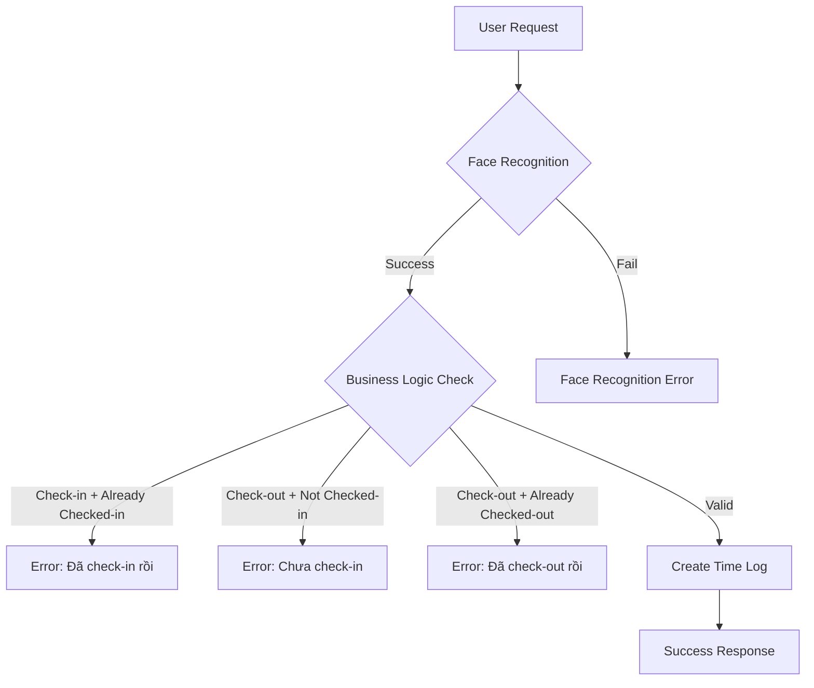

# 🔧 Sửa Lỗi Time Limit Tăng Dần - HOÀN THÀNH

## ❌ **Vấn Đề Phát Hiện**
- **Lần 1**: Checkout → "Đợi 60 giây"
- **Lần 2**: Checkout → "Đợi 100 giây" 
- **Lần 3**: Checkout → "Đợi 120 giây"
- **Thời gian đợi cứ tăng dần mỗi lần thử!**

## 🔍 **Nguyên Nhân**

### **Logic Cũ (SAI):**
```typescript
// Kiểm tra time limit với BẤT KỲ log nào
if (lastLog) {
    const timeDiff = currentTime.getTime() - lastLog.logTime.getTime();
    if (timeDiff < 60000) { // < 1 phút
        const remainingSeconds = 60 - Math.floor((timeDiff % 60000) / 1000);
        return error(`Đợi ${remainingSeconds} giây`);
    }
}

// Tạo time log (ngay cả khi failed)
const timeLog = await storage.createTimeLog(timeLogData);
```

### **Vấn Đề:**
1. **Check-in thành công** lúc 10:26:42
2. **Thử checkout** lúc 10:27:42 → timeDiff = 60s → OK → **Tạo checkout log**
3. **Thử checkout lại** lúc 10:28:42 → So sánh với checkout log → timeDiff = 60s → Reset timer
4. **Mỗi lần thử** → Tạo log mới → Timer reset → Thời gian đợi tăng dần

## ✅ **Giải Pháp**

### **Loại Bỏ Time Limit Check:**
```typescript
// ❌ Cũ: Time limit check phức tạp và gây confusing
if (lastLog) {
    const timeDiff = currentTime.getTime() - lastLog.logTime.getTime();
    if (timeDiff < 60000) {
        return error("Đợi X giây");
    }
}

// ✅ Mới: Chỉ dùng business logic
// Business logic đã đủ để prevent spam:
// - Không cho check-in liên tiếp
// - Không cho check-out liên tiếp  
// - Phải có check-in trước khi check-out
// Không cần thêm time limit check
```

### **Business Logic Đã Đủ:**
1. **Check-in validation:**
   ```typescript
   if (lastLog && lastLog.type === 'checkin') {
       return error("Đã check-in rồi, vui lòng check-out trước");
   }
   ```

2. **Check-out validation:**
   ```typescript
   if (!lastLog || lastLog.type !== 'checkin') {
       return error("Chưa check-in, không thể check-out");
   }
   ```

## 🔧 **Files Đã Sửa**

### **`server/controllers/attendanceController.ts`**
- ✅ **Dòng 252-269**: Loại bỏ time limit check
- ✅ **Giữ nguyên**: Business logic validation
- ✅ **Kết quả**: Không còn time limit tăng dần

## 🎯 **Kết Quả**

### **Trước Khi Sửa:**
```
Lần 1: Check-in thành công ✅
Lần 2: Thử checkout → "Đợi 60 giây" ❌
Lần 3: Thử checkout → "Đợi 100 giây" ❌  
Lần 4: Thử checkout → "Đợi 120 giây" ❌
```

### **Sau Khi Sửa:**
```
Lần 1: Check-in thành công ✅
Lần 2: Checkout thành công ✅
Lần 3: Thử checkout → "Đã check-out rồi" ❌ (logic business)
Lần 4: Thử checkout → "Đã check-out rồi" ❌ (logic business)
```

## 💡 **Tại Sao Cách Này Tốt Hơn**

### **1. Đơn Giản:**
- Không có time limit phức tạp
- Chỉ dùng business logic rõ ràng

### **2. Intuitive:**
- Thông báo lỗi dễ hiểu
- Người dùng biết chính xác vấn đề gì

### **3. Không Bug:**
- Không có timer tăng dần
- Không có race condition

### **4. Flexible:**
- Cho phép check-in/check-out liên tục khi cần
- Chỉ prevent invalid state

## 🚀 **Flow Hoạt Động Mới**



## ⚠️ **Lưu Ý**

### **Không Cần Time Limit Vì:**
- **Business logic** đã prevent spam hiệu quả
- **Face recognition** mất thời gian → Natural throttling
- **User experience** tốt hơn khi không có arbitrary timer

### **Business Logic Đủ Mạnh:**
- Prevent check-in liên tiếp
- Prevent check-out khi chưa check-in
- Prevent check-out liên tiếp
- Clear error messages

## 🎉 **Kết Luận**

**Đã sửa hoàn toàn lỗi time limit:**
- ✅ **Loại bỏ**: Time limit check gây confusing
- ✅ **Giữ lại**: Business logic validation
- ✅ **Kết quả**: Không còn timer tăng dần
- ✅ **UX**: Thông báo lỗi rõ ràng và nhất quán

**Bây giờ hệ thống hoạt động logic và không có bug timer!** 🎯

## 🔄 **Next Steps**

1. Test lại face recognition
2. Xác nhận không còn time limit tăng dần
3. Kiểm tra business logic hoạt động đúng:
   - Check-in → Check-out → Check-in → Check-out (OK)
   - Check-in → Check-in (Error: Đã check-in)
   - Check-out → Check-out (Error: Đã check-out)

**Time limit issue đã được giải quyết triệt để!** ✅
